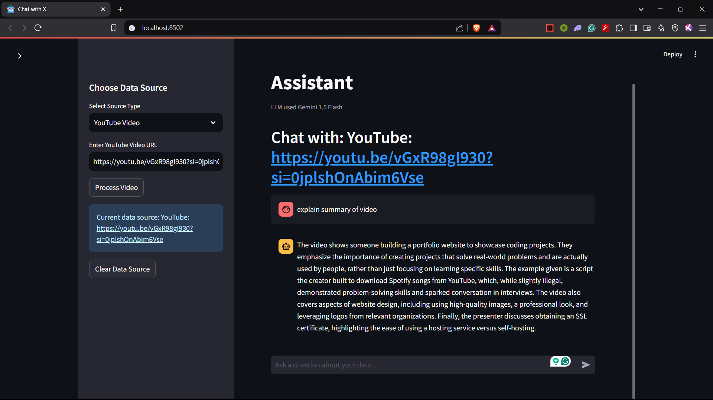
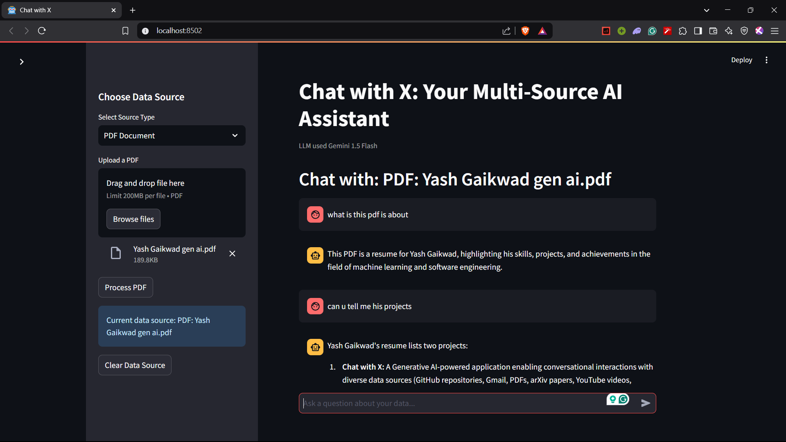

# Chat with X: Gemini-Powered Multi-Source Chat Application

This application enables conversational interactions with various data sources using Google's Gemini 1.5 Flash model (free) and Streamlit. Users can chat with data from:

- PDF documents
- GitHub repositories
- YouTube videos
- Web content (arXiv papers, Substack newsletters, etc.)

## Features

- 🔍 Semantic search and vector-based retrieval
- 🧠 Context-aware responses using Google's Gemini 1.5 Flash model (free tier)
- 🌐 Support for multiple data sources
- 💬 Conversational memory to maintain context
- 🖥️ Clean Streamlit interface




## Setup Instructions

### Prerequisites

- Python 3.8 or higher
- Google Gemini API key (Get one from [Google AI Studio](https://ai.google.dev/))

### Installation

1. Clone this repository:
   ```bash
   git clone https://github.com/whothefisyash/chatwithx.git
   cd chatwithx
   ```

2. Create a `.env` file in the project root and add your Google API key:
   ```
   GOOGLE_API_KEY=your_gemini_api_key_here
   ```

3. Install the required packages:
   ```bash
   pip install -r requirements.txt
   ```

4. Run the Streamlit app:
   ```bash
   streamlit run app.py
   ```

5. Open your browser and navigate to `http://localhost:8501`

### Usage

1. Select a data source type (PDF, GitHub, YouTube, or Web)
2. Provide the necessary input (upload a file or enter a URL)
3. Click the "Process" button
4. Once processing is complete, you can start chatting with your data

## How It Works

1. **Data Ingestion**: The application loads content from your chosen source
2. **Text Processing**: Documents are split into manageable chunks
3. **Vector Embedding**: Text chunks are converted to vector embeddings using Gemini
4. **Semantic Search**: When you ask a question, the system finds relevant chunks
5. **Response Generation**: Gemini generates a contextual response based on retrieved information

## Project Structure

- `app.py`: Main Streamlit application
- `.env`: Environment file for API keys 
- `config.py`: Config files(no need)
- `seperate` : this folder contains rag for each tasks(llm used is openai)
- `demo `: Contains images of project
- `requirements.txt`: Required Python packages
